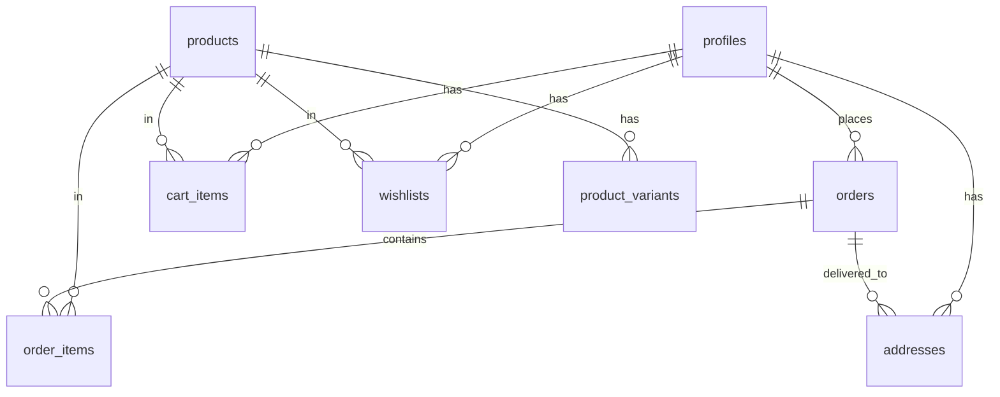

# Architecture Analysis - Fashion E-Commerce Platform

## Executive Summary

This document outlines the current state of the project architecture based on analysis of existing files. The project follows a **DECOUPLED (DOUBLE) ARCHITECTURE** with separate frontend and backend layers.

---

## Current Project State

### Frontend (EXISTS - Ready)
- **Location**: `frontend/`
- **Framework**: React 19 + Vite
- **Styling**: Tailwind CSS + shadcn UI components
- **Hosting**: Hostinger (static)
- **Status**: Built and deployed

### Backend (DOES NOT EXIST)
- **Location**: `backend/` - Not created
- **Expected**: Node.js + Express + Supabase
- **Status**: Needs to be built from scratch

---

## Frontend Architecture

### Technology Stack
| Component | Technology |
|-----------|------------|
| UI Framework | React 19 |
| Build Tool | Craco/Vite |
| Styling | Tailwind CSS 3.4 |
| UI Components | shadcn UI (Radix primitives) |
| HTTP Client | Axios |
| Database Client | Supabase JS SDK |
| State Management | React Context + localStorage |
| Routing | React Router DOM 7 |

### Frontend Services

#### 1. API Service ([`frontend/src/services/api.js`](frontend/src/services/api.js))
- Base URL: `http://localhost:5000/api/v1` (configurable via `REACT_APP_API_URL`)
- Features:
  - Axios instance with interceptors
  - JWT token management in localStorage
  - Automatic 401 handling (redirect to login)
  - Standardized response format

#### 2. Supabase Service ([`frontend/src/services/supabaseService.js`](frontend/src/services/supabaseService.js))
- Direct Supabase client operations:
  - `fetchProducts()` - Get products with filters
  - `getCart()` / `addToCart()` / `removeFromCart()` - Cart management
  - `createOrder()` / `fetchUserOrders()` - Order operations
  - `getWishlist()` - Wishlist management
  - Authentication: `signIn()`, `signUp()`, `signOut()`
- Fallback to localStorage for unauthenticated users

#### 3. Supabase Client ([`frontend/src/lib/supabase.js`](frontend/src/lib/supabase.js))
- Singleton Supabase client instance
- Environment variables: `REACT_APP_SUPABASE_URL`, `REACT_APP_SUPABASE_ANON_KEY`
- Auto-refresh token enabled

### Frontend Pages & Routing

| Page | Route | Function |
|------|-------|----------|
| HomePage | `/` | Product listing, featured products |
| ProductListingPage | `/products` | Filterable product grid |
| ProductDetailPage | `/product/:id` | Product details, size/color selection |
| CartPage | `/cart` | Cart management |
| CheckoutPage | `/checkout` | Multi-step checkout flow |
| LoginPage | `/login` | User authentication |
| OrderConfirmationPage | `/order-confirmation` | Post-order confirmation |
| OrderTrackingPage | `/order-tracking/:id` | Order status |
| AccountDashboardPage | `/account` | User profile, orders, addresses |
| WishlistPage | `/wishlist` | Saved items |
| AdminDashboardPage | `/admin` | Admin overview |
| AdminProductsPage | `/admin/products` | Product CRUD |
| AdminOrdersPage | `/admin/orders` | Order management |
| AdminUsersPage | `/admin/users` | User management |

### Expected API Endpoints

The frontend expects these backend endpoints (per [`CheckoutPage.jsx:69-194`](frontend/src/pages/CheckoutPage.jsx), [`AdminProductsPage.jsx:70`](frontend/src/pages/admin/AdminProductsPage.jsx)):

#### Authentication (`/api/v1/auth`)
```
POST   /auth/register     - User registration
POST   /auth/login        - User login
```

#### Products (`/api/v1/products`)
```
GET    /products          - List products (with filters)
GET    /admin/products    - Admin product list
POST   /admin/products    - Create product
PUT    /admin/products/:id - Update product
DELETE /admin/products/:id - Delete product
```

#### Cart (`/api/v1/cart`)
```
GET    /cart              - Get cart items
POST   /cart              - Add to cart
PUT    /cart/:itemId      - Update quantity
DELETE /cart/:itemId      - Remove item
DELETE /cart              - Clear cart
```

#### Orders (`/api/v1/orders`)
```
GET    /orders            - User orders
POST   /orders            - Create order
```

#### Addresses (`/api/v1/addresses`)
```
GET    /addresses         - Get saved addresses
POST   /addresses         - Save new address
```

#### Admin (`/api/v1/admin`)
```
GET    /admin/products    - Product management
GET    /admin/orders     - All orders
PUT    /admin/orders/:id/status - Update order status
```

---

## Backend Architecture (REQUIRED)

### Required Stack
| Component | Technology |
|-----------|------------|
| Runtime | Node.js 18+ |
| Framework | Express.js |
| Database | PostgreSQL (Supabase) |
| Auth | Supabase Auth + JWT |
| Validation | express-validator |

### Required Database Schema

Based on frontend usage, these tables are required:

```sql
-- Core Tables
profiles (extends Supabase auth.users)
products
product_variants
cart_items
orders
order_items
addresses
wishlists

-- Lookup Tables
categories
brands
```

### Database Entity Relationships



---

## Payment Integration

### Current State
- Frontend has payment method selection (COD/Prepaid)
- No Razorpay integration found in frontend code
- Backend must handle payment verification

### Required Implementation
1. Backend creates Razorpay order on order creation
2. Frontend receives payment order ID
3. Frontend initiates Razorpay checkout
4. Backend verifies payment webhook
5. Order status updated to "paid"

---

## Admin System

### Admin Routes
- `/admin` - Dashboard with statistics
- `/admin/products` - Full CRUD for products
- `/admin/orders` - View and update order status
- `/admin/users` - View user information

### Admin Features Expected
- Product image upload
- Inventory management
- Order status updates (pending → shipped → delivered)
- Customer information viewing

---

## Security Requirements

### Row Level Security (RLS)
All tables must have RLS policies:
- Users can read/write own data
- Admin can read/write all data
- Public can read products only

### Environment Variables Required

**Backend (.env)**
```
NODE_ENV=development
PORT=5000
SUPABASE_URL=https://xxx.supabase.co
SUPABASE_ANON_KEY=xxx
SUPABASE_SERVICE_ROLE_KEY=xxx
JWT_SECRET=xxx
CORS_ORIGIN=http://localhost:3000
FRONTEND_URL=http://localhost:3000
RAZORPAY_KEY_ID=xxx
RAZORPAY_KEY_SECRET=xxx
```

**Frontend (.env)**
```
REACT_APP_API_URL=http://localhost:5000/api/v1
REACT_APP_SUPABASE_URL=https://xxx.supabase.co
REACT_APP_SUPABASE_ANON_KEY=xxx
```

---

## Development Plan Summary

### Phase 1: Backend Setup
1. Create backend folder structure
2. Set up Express server
3. Configure Supabase connection
4. Create database schema

### Phase 2: API Implementation
1. Auth endpoints (register, login)
2. Product CRUD endpoints
3. Cart endpoints
4. Order endpoints
5. Address endpoints
6. Wishlist endpoints

### Phase 3: Admin Features
1. Admin middleware (role check)
2. Product management endpoints
3. Order management endpoints
4. Dashboard statistics

### Phase 4: Payment Integration
1. Razorpay order creation
2. Payment webhook handler
3. Payment verification

### Phase 5: Security
1. RLS policies
2. Input validation
3. Rate limiting
4. Error handling

---

## Key Findings

1. **Frontend is complete** - All UI components, pages, and services are built
2. **Backend needs creation** - No backend folder exists in workspace
3. **Database schema needed** - Must be created in Supabase
4. **Payment not integrated** - Razorpay needs backend implementation
5. **Dual communication** - Frontend uses both REST API and direct Supabase calls
6. **Admin panel built** - Frontend admin pages expect specific API responses

---

## Next Steps

1. **Create backend project** with Express + Supabase
2. **Define database schema** matching frontend requirements
3. **Implement all API endpoints** listed above
4. **Add Razorpay payment integration**
5. **Configure RLS policies** for security
6. **Test end-to-end flow** from frontend to backend
